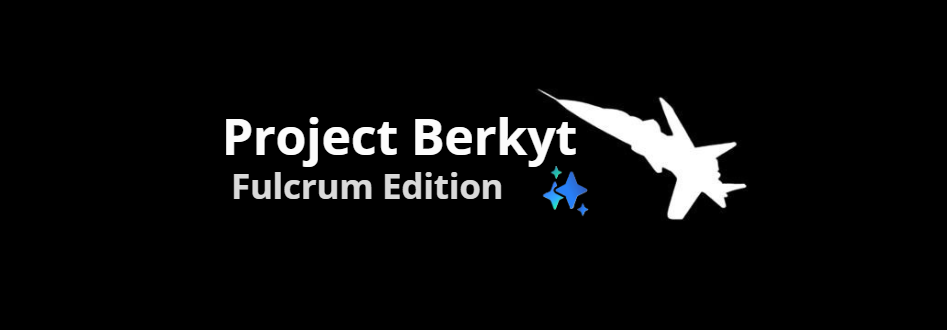

<h1 align="center">
  
</h1>
<p align="center">
  <a href="https://github.com/Yacinegti-DZ/Project-Berkyt/blob/sixteen/LICENSE"></a>
  <a href="https://github.com/Yacinegti-DZ/Project-Berkyt/commits/sixteen"></a>
  <a href="https://github.com/Yacinegti-DZ/Project-Berkyt/stargazers"></a>
</p>
</p>
<p align="center">Project Berkyt is a work-in-progress custom firmware for the Samsung Galaxy S21 5G, bringing OneUI 8.5 ported from the Galaxy S24+.</p>

<p align="center">
  <a href="https://t.me/project_berkyt">💬 Telegram</a>
  •
  <a href="https://github.com/FlopKernel-Series/flop_exynos2100_kernel">🧠 Kernel Source</a>
</p>

# What is Project Berkyt?
Project Berkyt is a work-in-progress custom firmware for the Samsung Galaxy S21 5G (SM-G991B/SM-G991N), bringing the OneUI 8.5 experience  ported from the Galaxy S24+ to the samsung galaxy s21 family.
The base is sourced from Samsung's S926B firmware on the latest security patch, fully deknoxed and optimized, with the complete Galaxy AI (S26 AI) suite and S26 sounds and ringtones. The base firmware is updated frequently, so expect regular patch-level updates to follow.
Any form of contribution, suggestion, bug report or feature request for the project is welcome.

# Features
### Core features:
- Based on Samsung's S24+ firmware
- Galaxy AI  support 
- S26 sounds and ringtones
- Picture remaster support
- Image clipper support
- Outdoor mode support
- High end animations
- Native/live blur support
- AOD clock transition support
- Adaptive color tone support
- Adaptive refresh rate support
- Extra brightness support
- Object, shadow and reflection eraser support
- Samsung DeX support
- Camera privacy toggle support
- Debloated from useless system services/additional apps
- Dual Messenger available for all apps
- Custom FlipFont fonts support
- Auto PIN confirm with 4 digits
- [BluetoothLibraryPatcher](https://github.com/3arthur6/BluetoothLibraryPatcher) integrated
- [KnoxPatch](https://github.com/salvogiangri/KnoxPatch) integrated
- Extra CSC features enabled (Call recording, Hiya, Network speed in status bar, AltZLife)
- Audio eraser
- Browsing assist
- Call assist
- Drawing assist
- Interpreter
- Note assist
- Now brief
- now nudge
- Photo assist
- Semantic search
- Transcript assist
- Writing assist


### UN1CA-exclusive features:
- Integrated OTA updates app
- Native/live blur toggle
- One UI Home animations option
- Vulkan renderer toggle
- Key attestation spoof ([TrickyStore](https://github.com/5ec1cff/TrickyStore)) options*
- Play Integrity Fix integrated
- Ability to hide installed apps ([Hide My Applist](https://github.com/Dr-TSNG/Hide-My-Applist))
- Ability to hide developer options
- Allow app downgrade toggle
- Allow installing apps with old targetSdk toggle
- Allow secure screenshot toggle
- Screenshot/screen recording detection toggle
- Unlimited backup storage on Google Photos
- Games FPS unlock toggle

\* Requires a valid keybox


# Licensing
This project is licensed under the terms of the [GNU General Public License v3.0](LICENSE). External dependencies might be distributed under a different license, such as:
- [android-tools](https://github.com/nmeum/android-tools), licensed under the [Apache License 2.0](https://github.com/nmeum/android-tools/blob/master/LICENSE)
- [apktool](https://github.com/iBotPeaches/Apktool), licensed under the [Apache License 2.0](https://github.com/iBotPeaches/Apktool/blob/master/LICENSE.md)
- [erofs-utils](https://github.com/sekaiacg/erofs-utils/), dual license ([GPL-2.0](https://github.com/sekaiacg/erofs-utils/blob/dev/LICENSES/GPL-2.0), [Apache-2.0](https://github.com/sekaiacg/erofs-utils/blob/dev/LICENSES/Apache-2.0))
- [img2sdat](https://github.com/xpirt/img2sdat), licensed under the [MIT License](https://github.com/xpirt/img2sdat/blob/master/LICENSE)
- [platform_build](https://android.googlesource.com/platform/build/) (ext4_utils, f2fs_utils, signapk), licensed under the [Apache License 2.0](https://source.android.com/docs/setup/about/licenses)

# Disclaimer

```cpp
#include <std_disclaimer.h>

/*
* Your warranty is now void.
*
* I am not responsible for bricked devices, dead SD cards,
* thermonuclear war, or you getting fired because the alarm app failed.
* YOU are choosing to make these modifications, and if
* you point the finger at me for messing up your device, I will laugh at you.
*/
```

# Contributors
- **[salvogiangri](https://github.com/salvogiangri)** for the UN1CA build system, OneUI patches.
- **[mecyanned](https://github.com/mecyanned)** thanks for your ammazing support and overall help!
- **[3q5i](https://github.com/3q5i)** for support and ideas for the ROM.
- **[Android Artisan](https://github.com/Android-Artisan)** for the amazing support since the beggining.
- More that I can't remember right now and will have to be added in the future

## Original UN1CA credits:
A special thanks goes to the following for their invaluable contributions in no particular order:
- **[ShaDisNX255](https://github.com/ShaDisNX255)** for his help, time and for his [NcX ROM](https://github.com/ShaDisNX255/NcX_Stock) which inspired this project
- **[DavidArsene](https://github.com/DavidArsene)** for his help and time
- **[paulowesll](https://github.com/paulowesll)** for his help and support
- **[Simon1511](https://github.com/Simon1511)** for his support and some of the device-specific patches
- **[ananjaser1211](https://github.com/ananjaser1211)** for troubleshooting and his time
- **[Fede2782](https://github.com/Fede2782)** for his contributions and help with Exynos/MTK support
- **[iDrinkCoffee](https://github.com/iDrinkCoffee-TG)** and **[RisenID](https://github.com/RisenID)** for their support
- **[LineageOS Team](https://www.lineageos.org/)** for their original [OTA updater implementation](https://github.com/LineageOS/android_packages_apps_Updater)
- **[salvogiangri](https://github.com/salvogiangri)** for the UN1CA build system, OneUI patches, and general help and support
- *All the UN1CA project forks, contributors, testers and users ❤️*

# Sources
- [UN1CA build system](https://github.com/salvogiangri/UN1CA)
